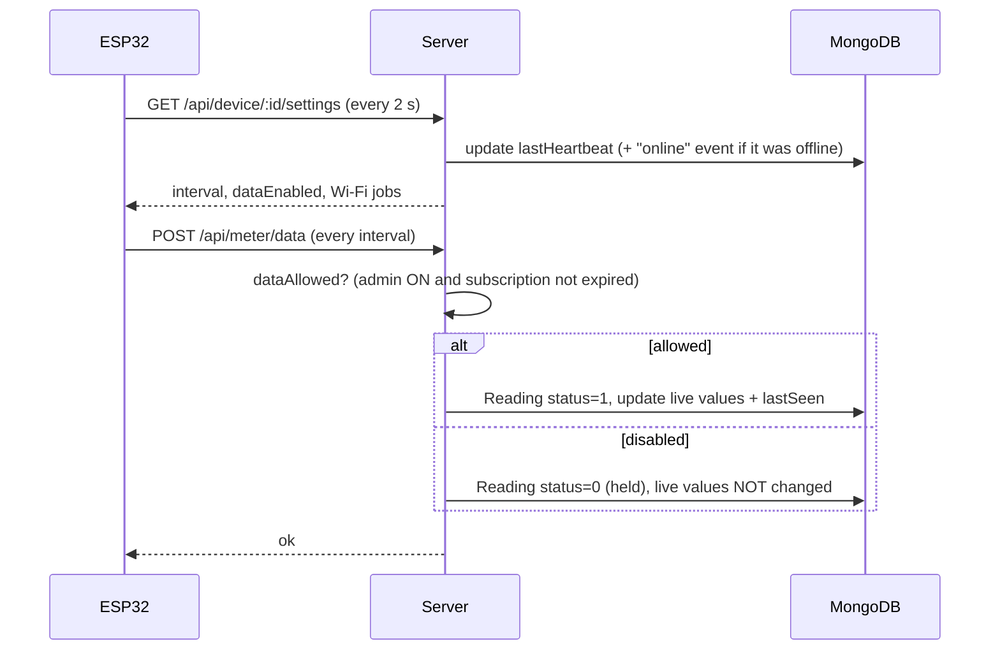
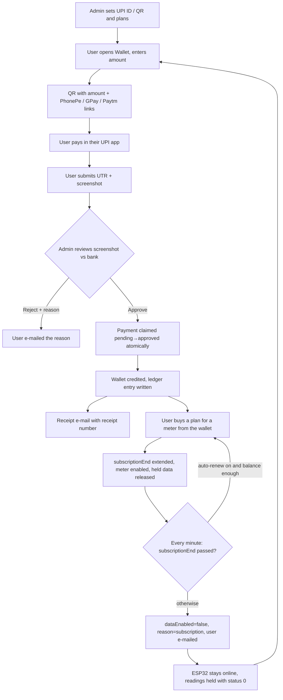

# Smart Energy Meter — Workflows

A subscription-based energy-monitoring service. An ESP32 + PZEM-004T reads voltage, current, power, energy, frequency and power factor and sends them to this server. Users see their readings, estimated cost and alerts; the admin manages meters, users, payments and subscriptions. **Users pay for the monitoring service (wallet → subscription), not for electricity.**

## 1. Pieces

| Piece | What it does |
|---|---|
| ESP32 firmware (`ESP32_FINAL.ino`) | Reads the PZEM, posts readings every *interval* seconds, polls settings every 2 s (this poll is also its "I'm online" heartbeat). Wi-Fi, server URL, meter ID and device token are entered once in the setup portal. |
| Server (`server.js`, Express) | REST API, authentication, billing estimates, wallet, payments, background jobs. |
| MongoDB | Users, meters, readings, presence events, wallet ledger, payments, plans, activity log, settings. |
| Admin dashboard (`/admin/dashboard.html`) | Meters, users, payments, wallets & plans, readings clean-up, online history, activity log, mail, security. |
| User dashboard (`/user/dashboard.html`) | Live readings, usage & cost, wallet, online history, alerts, meter settings. |
| `uploads/` folder | Payment screenshots and the admin's QR image (served only to authorised users). |

## 2. Roles

- **Admin** – registers meters (gets a one-time device token), creates users, assigns meters, sets tariffs/limits, configures mail and UPI, approves payments, can switch a meter's data collection ON/OFF, add subscription days, adjust wallets, delete garbage readings and erase a meter's data.
- **User** – sees only meters assigned to them: readings, cost estimates, alerts, online history; recharges the wallet; subscribes/auto-renews meters; sets personal alert limits.

## 3. Device data flow (every few seconds)

- The device is authenticated by its bearer token (hash compared in constant time).
- **Online** = the ESP32 contacted the server in the last 20 s, whether or not data collection is enabled.

## 4. Data held while collection is OFF (nothing is lost)

Example: the admin disables a meter at 9:00 and the user pays and is re-enabled at 11:00.

1. 09:00 – data collection OFF (or the subscription expires and the sweeper switches it OFF).
2. 09:00–11:00 – the ESP32 stays powered and **online**. Each reading is saved as `status = 0` (**held**). Held readings are excluded from every user view, chart, bill estimate, CSV and report. The live values on the dashboard stay at the last visible reading. The user sees *"online, but disabled/expired — readings from this period are kept safely and will appear once enabled"*.
3. 11:00 – data collection is turned ON again (admin toggle, admin adds days, user renews from the wallet, or auto-renew). The server sets every `status = 0` reading of that meter to `status = 1` and refreshes the live values. The 09:00–11:00 data now appears in the user's charts and usage totals.
4. Admins see held readings in *Readings clean-up* (tagged **HELD · status 0**, with a counter) and can delete them like any other reading.

An admin-disabled meter is **not** re-enabled by a renewal; only the admin can turn it ON. An expired subscription cannot be switched ON by the admin until days are added.

## 5. Subscription & wallet

Rules: the wallet balance can never go negative; a UTR can be used once; a payment can be approved only once; the ledger (`WalletTxn`) is append-only; a reminder e-mail goes out 3 days before expiry; meters with no end date never expire.

## 6. Alerts and e-mail

- **On the dashboard**: offline, over/under-voltage, over-current, over-power, low power factor, daily/monthly limits, abnormal use — judged against the user's own limits where set, otherwise the admin's.
- **By e-mail (user opt-in)**: every 30 s the server checks each assigned meter; a new alert is e-mailed once to the owner's registered address (not repeated until it clears), offline after 2 minutes, plus a "back online" notice. Admins can optionally be copied.
- Every e-mail sent or failed (recipient, reason) is written to the Activity log → *E-mail deliveries*.

## 7. Online history

Each time a meter goes online/offline a `PresenceEvent` is written (online on first heartbeat, offline when the 10-second sweeper sees 20 s of silence, stamped with the last heartbeat time). *Online history* draws a 24-hour timeline for any day (India time) for admin and user.

## 8. Sign-in and audit trail

Login (optional e-mail OTP) → JWT (7 days). Logins, logouts, failed logins, admin changes, payments, wallet adjustments, subscriptions, deletions and e-mails are recorded in the Activity log (kept 90 days), filterable by type.

## 9. Garbage values, deleting and erasing

| Action | Effect |
|---|---|
| Delete selected / Delete all suspicious (*Readings clean-up*) | Removes just those readings (impossible values such as voltage > 300 V, PF > 1, frequency outside 40–70 Hz); live values resync to the newest remaining visible reading. |
| **Erase all data** (meter card, type the meter ID to confirm) | **Permanent.** Deletes every reading (visible and held), the online history and Wi-Fi jobs of that meter, and resets name, assignment, subscription, auto-renew, interval and permissions to defaults. The meter record and its device token stay so the ESP32 keeps working. Wallet transactions are financial records and are kept. |
| Delete meter | Removes the meter itself together with all of the above. |

## 10. Background jobs (all in `server.js`)

| Every | Job |
|---|---|
| 10 s | Presence sweep – mark silent meters offline. |
| 30 s | Alert check – send opt-in alert e-mails. |
| 60 s | Subscription check – auto-renew or disable expired meters, send reminders. |
| 60 s | Scheduled daily / weekly / monthly energy reports. |

## 11. Quick reference – who sees what

| | Visible readings (`status 1`) | Held readings (`status 0`) | Wallet / payments |
|---|---|---|---|
| User | Yes | No | Own only |
| Admin | Yes | Yes (Readings clean-up) | All |
